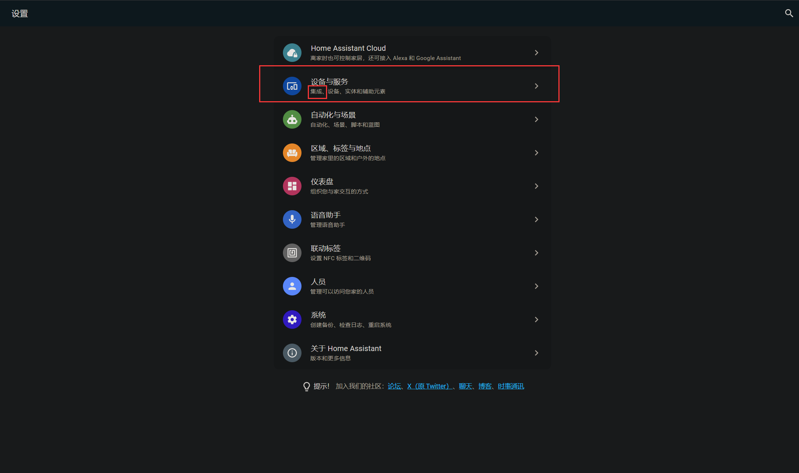
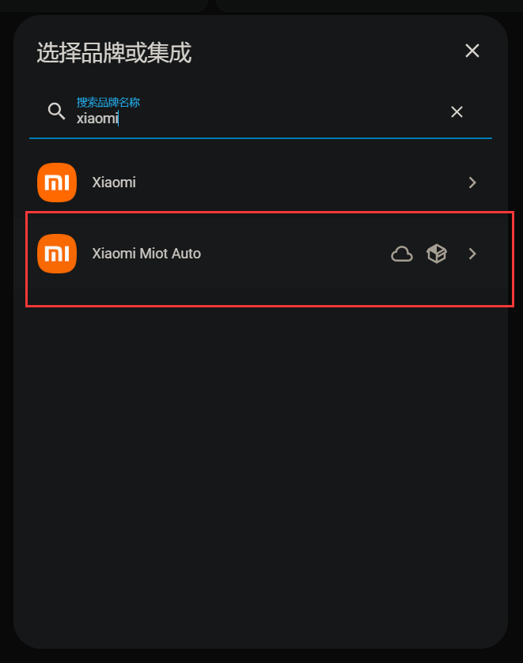
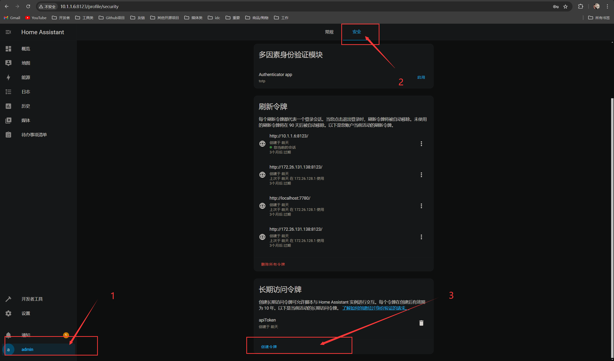

# 小米智能插座通过米家接入HA然后接入koishi
多此一举的操作（）  
不想一步步详细贴出来，毕竟网上都有了，我还写几把（

## HomeAssistant 接入米家app的小米智能插座
### HomeAssistant 部署
可以看看官网，建议使用Docker  
* [HomeAssistant-Docker](https://www.home-assistant.io/installation/linux/#survey_section)
```bash
docker run -d \
  --name homeassistant \
  --privileged \
  --restart=unless-stopped \
  -e TZ=Beijing \
  -v /opt/homeassistant/comfig:/config \
  -v /run/dbus:/run/dbus:ro \
  --network=host \
  ghcr.io/home-assistant/home-assistant:stable
```
* 此处`/opt/homeassistant/config`是docker映射到宿主机的配置文件路径
* 浏览器访问`http://<host>:8123`
* 创建账号等操作

### HomeAssistant接入米家
* 1. 在首页左下角（也许），打开`设置/配置`
  
* 2. 然后打开含有`集成`的配置项
  
* 3. 添加集成然后在搜索栏搜索`xiaomi`,选择`xiaomi Miot auto`
  
* 4. 然后选择`Add devices using Mi Account (账号集成)`(后面懒得截图了)
* 5. 填入账号密码, `Cloud (云端模式)`, 别选`通过型号/家庭/WiFi筛选设备 (高级模式，新手勿选)`
* 6. 然后账号绑定的设备就显示在首页了

## koishi接入HA
* 1. 需要在HA创建Token
  
* 2. 复制Token，记住这个Token
* 3. 参考HA的[REST API](https://developers.home-assistant.io/docs/api/rest/)
* 4. 创建 koishi 插件, 为了更直观的的观测可以做成图表, 因此需要`puppeteer`
* 5. 对了，这里说一下怎么获取传感器ID。
  
  
* 6. 这个就是传感器的ID，也就是api里的`<entity_id>`

koishi插件代码
:::details
```javascript
import { Context, Schema, h, sleep } from 'koishi'
import { resolve } from 'path'
import {} from "koishi-plugin-puppeteer";
import { Page } from "puppeteer-core";
import fs from 'fs'
import path from 'path'

export const name = 'mi-plug-status'

export interface Config {}

export const Config: Schema<Config> = Schema.object({})

export const inject = ['puppeteer']

export function apply(ctx: Context) {
  // write your plugin here
  const apiUrl = 'http://<host>:8123';
  // 0:当前功率 1:今日用电 2:本月用电
  const statusArray = ['sensor.cuco_v3_e0d8_electric_power','sensor.cuco_v3_e0d8_power_cost_today','sensor.cuco_v3_e0d8_power_cost_month'];

  const headers = {
    'Authorization': 'Bearer ${Token}',
    'Content-Type': 'application/json'
  };

  ctx.command('miotshow [mode:number]', '获取米家设备状态(当前仅有米家只能开关)').alias('米家状态').alias('当前米家')
  .option('text', '-t [mode:number] 文本模式')
  .action(async ({session, options}, mode) => {
    if (options.text) {
      let powerData = [(await ctx.http.get(`${apiUrl}/api/states/${statusArray[0]}`, {headers})).attributes['electric_power-11-2'], (await ctx.http.get(`${apiUrl}/api/states/${statusArray[1]}`, {headers})).attributes['power_cost_today'], (await ctx.http.get(`${apiUrl}/api/states/${statusArray[2]}`, {headers})).attributes['power_cost_month']]
      return <>
          当前设备: 小米智能插座3(2022款)&#10;
          当前功率: {powerData[0]}W&#10;
          今日用电: {powerData[1]/100}度(kWh)&#10;
          本月用电: {powerData[2]/100}度(kWh)
          </>
    }
    let page: Page;
    let data:any = await renderImage(ctx, mode);
    // console.log(JSON.stringify(data.y))
    session.send("请稍等，正在加速渲染图片>>>>")
    try {
      page = await ctx.puppeteer.page();
      await page.setViewport({ width: 570, height: 352 });
      await page.goto(`file:///${resolve(__dirname, "./template.html")}`)
      await page.waitForNetworkIdle();
      mode? await page.evaluate(`drawChart2(${JSON.stringify(data.y)}, ${JSON.stringify(data.x)})`):await page.evaluate(`drawChart(${JSON.stringify(data.y)})`);
      // await new Promise(resolve => setTimeout(resolve, 1000));
      await sleep(500);
      const element = await page.$("body");
      return h.image(await element.screenshot({
        encoding: "binary"
      }), "image/png")
    } catch (e) {
      console.log(e);
      return '渲染失败' + e.message;
    } finally {
      page?.close();
    }
  })
}

async function renderImage(ctx: Context, type?: number) {
  type |= 0;
  const apiUrl = 'http://<host>:8123';
  const statusArray = ['sensor.cuco_v3_e0d8_electric_power','sensor.cuco_v3_e0d8_power_cost_today'];
  const headers = {
    'Authorization': 'Bearer ${Token}',
    'Content-Type': 'application/json'
  };
  const apiPath = '/api/history/period?filter_entity_id='+statusArray[type? 1:0];
  let getData = await ctx.http.get(`${apiUrl}${apiPath}`, {headers});
  let time = type? ((getData.flat().map(i => i.attributes.updated_time).reverse()).filter((time, index, self) => {
    const dateHourPart = time?.toString().split('T')[0] + 'T' + time?.toString().split('T')[1].split(':')[0]; // 提取日期和小时部分
    return self.findIndex(t => t?.toString().startsWith(dateHourPart)) === index;
  }).map(item => item.toString().slice(5,14).replace('-','月').replace('T','日').replace(':','时'))):null;

  let data = {
    y: type? (getData.flat().map((item: any) => Number(item.state))).reverse().slice(0, time? time.length:13):(getData.flat().map((item: any) => Number(item.state))).reverse().filter((_, index:number) => type? null:(index % 5 === 0)).slice(0, 13),
    x: time
  }
  return data;
}
```
:::

`template.html`使用canvas画图

:::details
```html
<!DOCTYPE html>
<html lang="en">
<head>
    <meta charset="UTF-8">
    <meta name="viewport" content="width=device-width, initial-scale=1.0">
    <title>Line Chart Example</title>
    <!-- 引入 Chart.js 库 -->
    <script src="https://jsd.in0.re/npm/chart.js"></script>
</head>
<body>
    <h1 id="h1" style="text-align: center;">小米智能插座 | 1h功耗图</h1>
    <!-- 创建一个 canvas 元素来绘制图表 -->
    <canvas id="myLineChart" width="400" height="200"></canvas>

    <script>
        function drawChart(data) {
            // 获取 canvas 元素
            var ctx = document.getElementById('myLineChart').getContext('2d');

            // 配置图表数据
            var myLineChart = new Chart(ctx, {
                type: 'line', // 图表类型
                data: {
                    labels: Array.from({ length: 13 }, (_, i) => i? (i * 5+'min'):'now'), // X 轴标签
                    datasets: [{
                        label: '功耗, 单位: W', // 数据集标签
                        data: data, // 数据
                        fill: false, // 不填充折线下方的区域
                        borderColor: 'rgba(75, 192, 192, 1)', // 折线颜色
                        tension: 0.1 // 折线曲率
                    }]
                },
                options: {
                    scales: {
                        // x: {
                        //     min: 'February', // X 轴起点
                        //     max: 'June' // X 轴终点
                        // },
                        y: {
                            beginAtZero: false, // Y 轴不从 0 开始
                            min: Math.min(...data) - 10,
                            max: Math.max(...data) + 5
                        }
                    }
                }
            });
        }

        function drawChart2(data, y) {
            // 获取 canvas 元素
            var ctx = document.getElementById('myLineChart').getContext('2d');
            var h1 = document.getElementById('h1');
            h1.innerHTML = '小米智能插座 | 近期用电量';
            // 配置图表数据
            var myLineChart = new Chart(ctx, {
                type: 'line', // 图表类型
                data: {
                    labels: y,//Array.from({ length: 13 }, (_, i) => i? (i+'days ago'):'today'), // X 轴标签
                    datasets: [{
                        label: '用电量, 单位: kWh', // 数据集标签
                        data: data, // 数据
                        fill: false, // 不填充折线下方的区域
                        borderColor: 'rgba(75, 192, 192, 1)', // 折线颜色
                        tension: 0.1 // 折线曲率
                    }]
                },
                options: {
                    scales: {
                        // x: {
                        //     min: 'February', // X 轴起点
                        //     max: 'June' // X 轴终点
                        // },
                        y: {
                            beginAtZero: false, // Y 轴不从 0 开始
                            min: Math.min(...data)? Math.min(...data) - 0.2 : 0,
                            max: Math.max(...data) + 0.1
                        }
                    }
                }
            });
        }
    </script>
</body>
</html>
```
:::

## 最后
* 以上是我的思路，当然代码烂了点，但是能用（）
* 由于没有泛用性，这个代码就放在博客，不放github了，等后面还有想法完善插件再说
